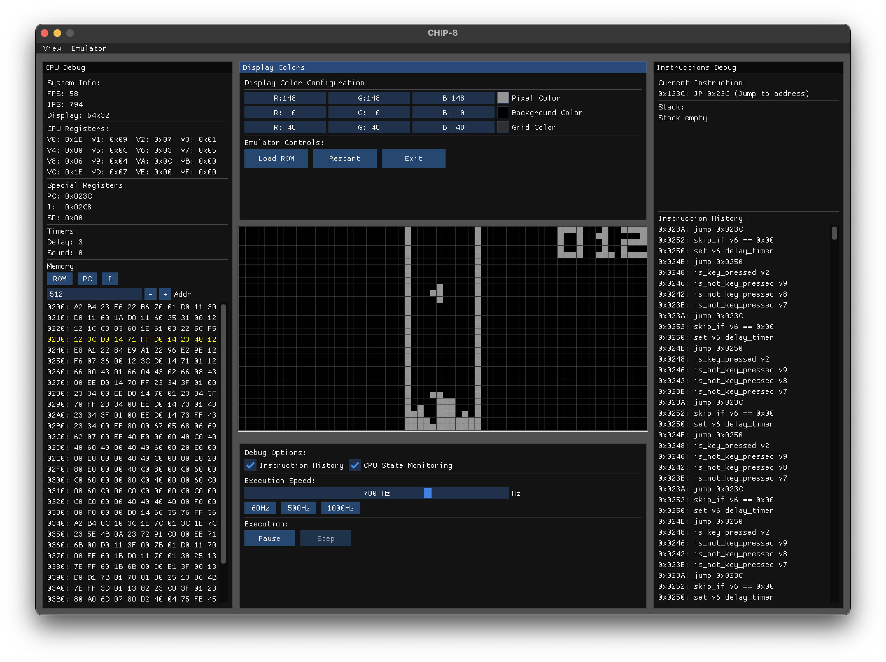

# Chip 8 Emulator



[Chip8](https://en.wikipedia.org/wiki/CHIP-8) emulator written in C# with Raylib and Dear ImGui for display/debug tools.

Built as a learning project. Tested only on OSX.

To run:

```
cd Chip8
dotnet restore
dotnet run
```